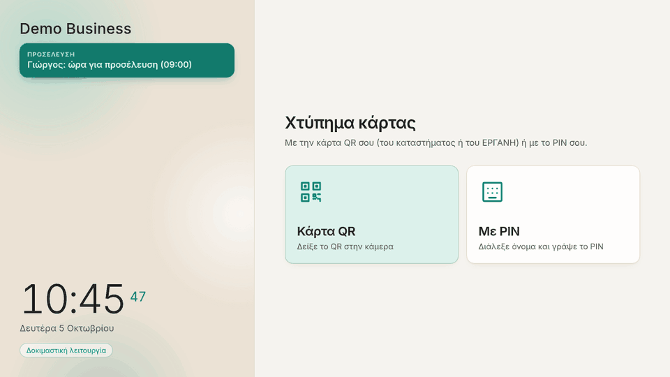
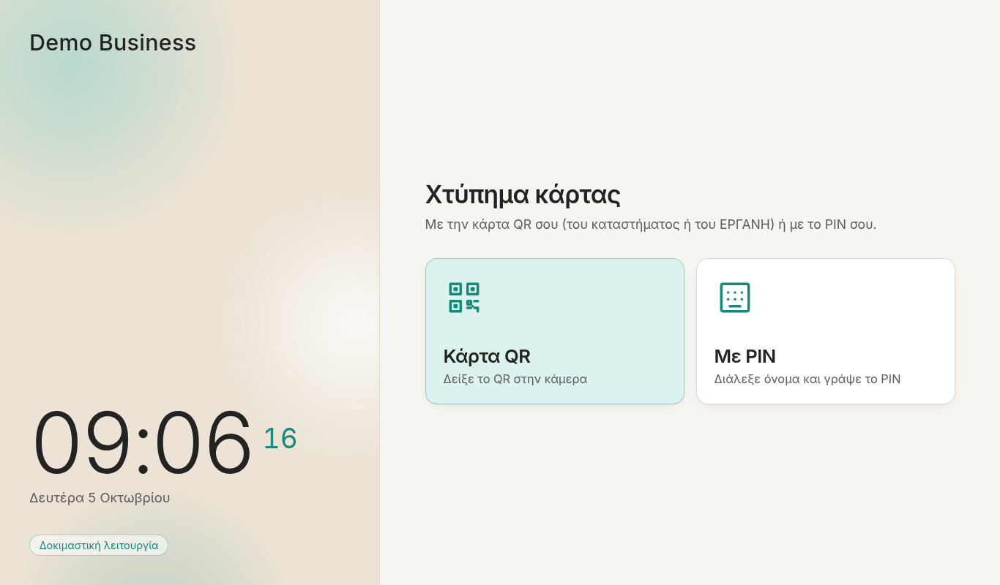
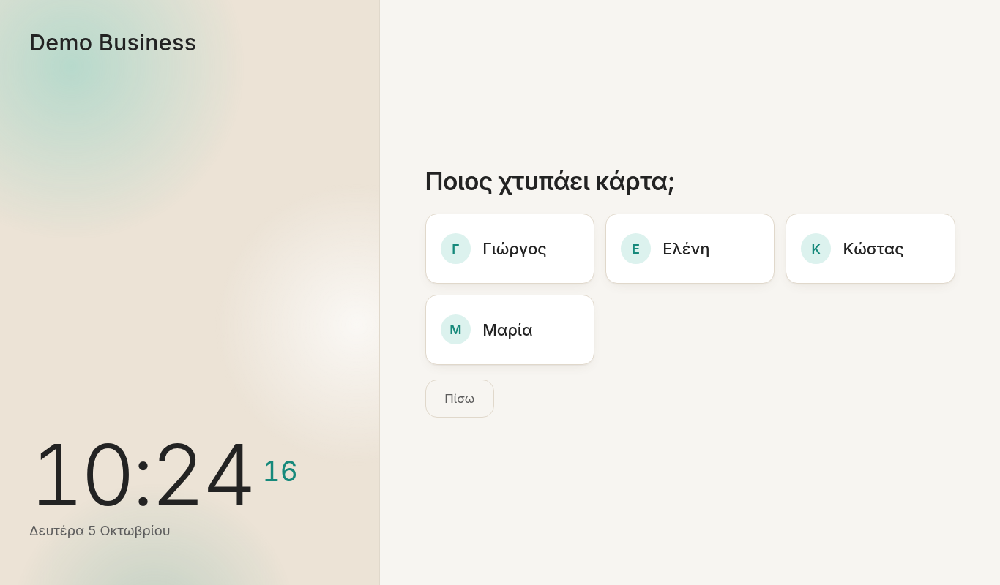
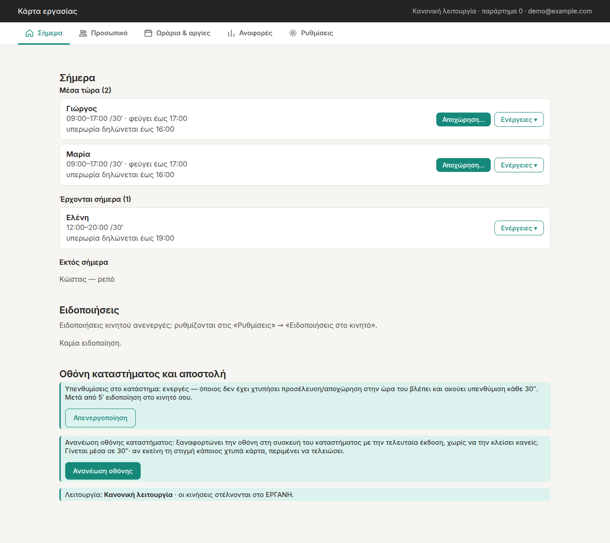
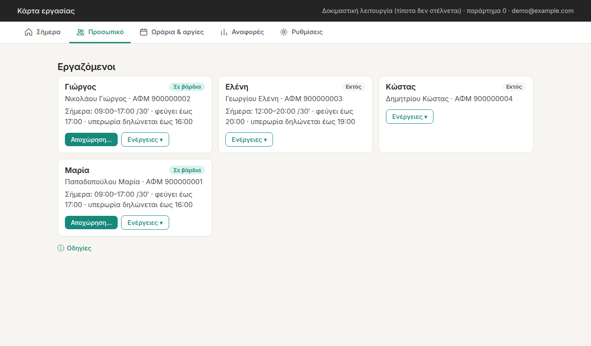
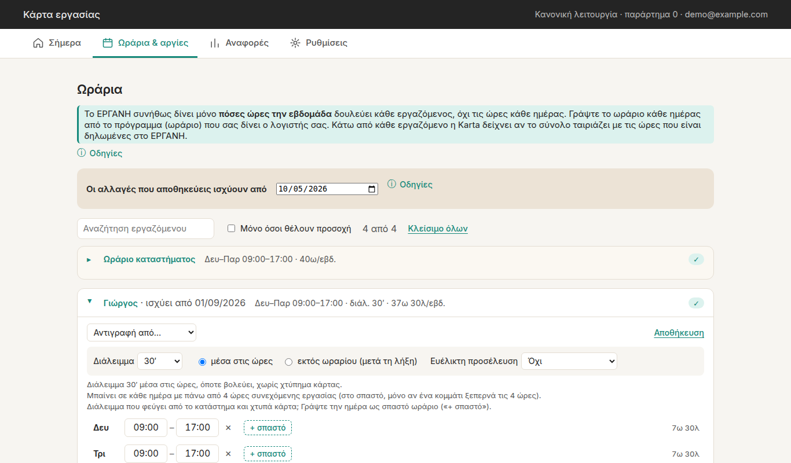

# Karta: ψηφιακή κάρτα εργασίας για το ΕΡΓΑΝΗ

🇬🇷 **Ελληνικά** · 🇬🇧 [English](#english)

Η **Karta** είναι ψηφιακή κάρτα εργασίας για μικρές επιχειρήσεις, που την εγκαθιστάτε στον
δικό σας server. Οι εργαζόμενοι χτυπούν κάρτα στην οθόνη του καταστήματος με PIN ή με
κωδικό QR. Η Karta στέλνει κάθε προσέλευση και αποχώρηση στο **ΕΡΓΑΝΗ ΙΙ** του Υπουργείου
Εργασίας, και δίνει στον ιδιοκτήτη μια σελίδα διαχείρισης με ωράρια, ειδοποιήσεις και
μηνιαίες αναφορές.

📖 **Πλήρης οδηγός χρήσης στο [wiki](https://github.com/osergios/karta/wiki)**:
εγκατάσταση, κάθε καρτέλα της διαχείρισης, η οθόνη του καταστήματος, πώς φτάνουν τα
χτυπήματα στο ΕΡΓΑΝΗ, ειδοποιήσεις και συχνές ερωτήσεις.

💬 **Ερωτήσεις και ιδέες** στις [Συζητήσεις](https://github.com/osergios/karta/discussions).

## Στιγμιότυπα

*Δοκιμαστική επιχείρηση με φανταστικούς εργαζόμενους, σε λειτουργία `dry_run`.*



| Οθόνη καταστήματος | Επιλογή ονόματος και μετά PIN |
|---|---|
|  |  |

| Διαχείριση: σήμερα | Διαχείριση: προσωπικό |
|---|---|
|  |  |



## Δυνατότητες

- **Οθόνη καταστήματος** (`/`): πληκτρολόγιο PIN και σκανάρισμα QR με την κάμερα.
  Δέχεται τις κάρτες QR του καταστήματος και το προσωπικό QR του εργαζόμενου από το
  ΕΡΓΑΝΗ / myErgani.
- **Κάρτα στο κινητό** (`/c/…`): κάθε εργαζόμενος αποθηκεύει την κάρτα QR του στο κινητό
  του από έναν προσωπικό σύνδεσμο.
- **Αποστολή στο ΕΡΓΑΝΗ:** ουρά με επαναλήψεις και αιτιολογίες εκπρόθεσμης δήλωσης. Μια
  υποβολή που μπορεί να έχει ήδη φτάσει στο ΕΡΓΑΝΗ δεν ξαναστέλνεται ποτέ αυτόματα·
  μπαίνει σε κατάσταση «Προς έλεγχο» για να αποφασίσει ο διαχειριστής.
- **Τρεις λειτουργίες:** `dry_run` (δεν στέλνεται τίποτα), `trial` (δοκιμαστικό
  περιβάλλον ΕΡΓΑΝΗ) και `production`.
- **Σελίδα διαχείρισης** (`/admin`, προστατευμένη με Cloudflare Access): εργαζόμενοι,
  PIN, ωράρια, άδειες, αργίες και κλεισίματα, ξεχασμένες αποχωρήσεις, λειτουργία
  εκπαίδευσης, και όνομα, χρώμα και λογότυπο της επιχείρησης.
- **Αυτόματοι έλεγχοι:** χτυπήματα που λείπουν, παραμονή μετά τη λήξη, όρια ημέρας και
  εβδομάδας, ανάπαυση. Οι ειδοποιήσεις πάνε στη σελίδα διαχείρισης, στην οθόνη του
  καταστήματος και προαιρετικά στο κινητό σας (μέσω [ntfy](https://ntfy.sh)).
- **Μηνιαίες και ετήσιες αναφορές** σε Excel για τον λογιστή, με τις απολογιστικές
  δηλώσεις που πρέπει να γίνουν.
- **Ρυθμίσεις από τη σελίδα διαχείρισης:** ΑΦΜ, χρήστης ΕΡΓΑΝΗ (με δοκιμή σύνδεσης,
  κρυπτογραφημένος κωδικός), ειδοποιήσεις στο κινητό και αλλαγή λειτουργίας με επιβεβαίωση.
- **Αντίγραφα ασφαλείας για χρόνια:** κάθε βράδυ, σε USB ή κρυπτογραφημένα σε cloud,
  επαναφορά με μία εντολή, και «Αρχείο χτυπημάτων» κάθε έτους σε Excel.

Το αναλυτικό ιστορικό αλλαγών είναι στο [`CHANGES.md`](CHANGES.md).

## Τι χρειάζεστε

- Docker, ή Python 3.12
- Χρήστη web services του ΕΡΓΑΝΗ για την επιχείρησή σας (ή δοκιμαστικό χρήστη από το
  `trialv2eservices.yeka.gr`)
- Μια εφαρμογή [Cloudflare Access](https://www.cloudflare.com/zero-trust/products/access/)
  μπροστά από το `/admin`

## Γρήγορη εκκίνηση

👉 **Δεν είστε προγραμματιστής;** Ακολουθήστε την [εύκολη εγκατάσταση, βήμα προς βήμα](https://github.com/osergios/karta/wiki/Easy-Installation) σε Raspberry Pi, παλιό PC ή δωρεάν cloud. Ο οδηγός ρύθμισης κάνει τα περισσότερα:

```bash
mkdir ~/karta && cd ~/karta
curl -fsSLO https://raw.githubusercontent.com/osergios/karta/main/setup.sh && chmod +x setup.sh
./setup.sh          # διεύθυνση και Cloudflare → .env, εκκίνηση, αντίγραφα ασφαλείας
./setup.sh check    # έλεγχος ότι όλα δουλεύουν
./setup.sh usb      # αντίγραφα και σε USB · ./setup.sh cloud: κρυπτογραφημένα σε cloud
```

Ή με το χέρι:

```bash
curl -fsSLO https://raw.githubusercontent.com/osergios/karta/main/.env.example
cp .env.example .env        # συμπληρώστε το· κρατήστε ERGANI_MODE=dry_run στην αρχή
docker run -d --name karta --env-file .env -p 8000:8000 -v karta-data:/data \
  ghcr.io/osergios/karta:latest
```

Έτοιμο image για amd64 και arm64. Οι εκδόσεις και οι αλλαγές τους είναι στις
[Releases](https://github.com/osergios/karta/releases). Μπορείτε επίσης να χτίσετε το image
μόνοι σας με `docker build -t karta .`.

Η βάση SQLite βρίσκεται στο `/data/workcard.db` (αλλάζει με το `DB_PATH`), οπότε
**κρατάτε αντίγραφα αυτού του volume** (τα χτυπήματα φυλάσσονται για χρόνια· δείτε
[Αντίγραφα ασφαλείας](https://github.com/osergios/karta/wiki/Backups)). Περιέχει στοιχεία
των εργαζομένων σας.

Χωρίς Docker:

```bash
pip install -r requirements.txt
PYTHONPATH=vendor uvicorn app.main:app --host 0.0.0.0 --port 8000
```

Όλες οι ρυθμίσεις εξηγούνται στο [`.env.example`](.env.example) και στο
[wiki](https://github.com/osergios/karta/wiki/Configuration). **Μην ανεβάσετε ποτέ το
πραγματικό σας `.env`.**

## Έναρξη κανονικής λειτουργίας

1. Τρέξτε σε `dry_run` και ελέγξτε στη σελίδα διαχείρισης τι θα στελνόταν.
2. Αλλάξτε σε `trial` («Ρυθμίσεις» → «Λειτουργία») και ελέγξτε τις κινήσεις στο
   δοκιμαστικό περιβάλλον του ΕΡΓΑΝΗ.
3. Αλλάξτε σε `production` (με επιβεβαίωση του ΑΦΜ και δοκιμή σύνδεσης).

Είστε υπεύθυνοι για τις δηλώσεις που γίνονται στο ΕΡΓΑΝΗ από την εγκατάστασή σας. Το
λογισμικό παρέχεται «ως έχει», χωρίς καμία εγγύηση (δείτε την άδεια χρήσης).

## Κώδικας τρίτων

Η Karta περιλαμβάνει το [Ergani Python SDK](https://github.com/withlogicco/ergani-python-sdk)
(MIT, της LOGIC), το [jsQR](https://github.com/cozmo/jsQR) (Apache-2.0), ένα εικονίδιο
από τα [Tabler Icons](https://github.com/tabler/tabler-icons) (MIT) και τη γραμματοσειρά
[Inter](https://github.com/rsms/inter) (SIL OFL 1.1). Λεπτομέρειες και οι τοπικές αλλαγές
στο [`THIRD_PARTY_NOTICES.md`](THIRD_PARTY_NOTICES.md).

## Άδεια χρήσης

Copyright © 2026 osergios. Ο κώδικας της Karta διατίθεται με την άδεια
[GNU Affero General Public License v3.0](LICENSE) (AGPL-3.0-only).

Με απλά λόγια: μπορείτε να χρησιμοποιήσετε, να αλλάξετε και να μοιραστείτε την Karta
ελεύθερα, ακόμα και σε επιχείρηση. Αν όμως διανείμετε μια τροποποιημένη έκδοση, ή την
προσφέρετε σε άλλους μέσω δικτύου (π.χ. ως υπηρεσία για καταστήματα), πρέπει να δώσετε
σε όσους τη χρησιμοποιούν **ολόκληρο τον πηγαίο κώδικά σας με την ίδια άδεια**. Δεν
επιτρέπεται να γίνει κλειστό, ιδιόκτητο προϊόν. Για εμπορική άδεια με άλλους όρους,
επικοινωνήστε με τον δημιουργό.

Τα ενσωματωμένα τμήματα τρίτων διατηρούν τις δικές τους άδειες (δείτε το
[`THIRD_PARTY_NOTICES.md`](THIRD_PARTY_NOTICES.md)). Για να συνεισφέρετε, δείτε το
[`CONTRIBUTING.md`](CONTRIBUTING.md).

---

<a id="english"></a>

# 🇬🇧 English

**Karta** is a self-hosted *ψηφιακή κάρτα εργασίας* (digital work card) for small
Greek businesses. Employees clock in and out on a shop kiosk with a PIN or a QR
code. Karta sends each arrival and departure to the Ministry of Labour's
**Ergani II** system and gives the owner an admin page with schedules, alerts and
monthly reports. The app's screens are in Greek.

📖 **Full documentation is in the [wiki](https://github.com/osergios/karta/wiki/Home-EN)**:
installation, every admin tab, the shop screen, how punches reach Ergani, alerts, and an
FAQ. The wiki pages live in [`docs/wiki/`](docs/wiki/) and are published automatically.

💬 **Questions and ideas** go to [Discussions](https://github.com/osergios/karta/discussions).

See the screenshots above.

## Features

- **Kiosk** (`/`): PIN pad and camera QR scanner. It accepts the shop's own QR
  cards and the employee's personal Ergani or myErgani QR.
- **Phone card** (`/c/…`): each employee saves their QR card to their phone from a
  personal link.
- **Ergani submission:** a queue with retries and late-declaration reasons. A
  submission that may already have reached Ergani is never retried automatically;
  it goes to a "needs checking" state for the admin to decide.
- **Three modes:** `dry_run` (nothing is sent), `trial` (Ergani test environment)
  and `production`.
- **Admin page** (`/admin`, protected by Cloudflare Access): employees, PINs,
  schedules, leave, holidays and closures, forgotten departures, training mode, and
  the business name, colour and logo.
- **Live checks:** missed punches, shift over-runs, daily/weekly limits and rest
  periods. Alerts go to the admin page, the shop screen and optionally your phone
  (via [ntfy](https://ntfy.sh)).
- **Monthly and yearly Excel reports** for the accountant, including the
  retrospective declarations to file.
- **Settings in the admin page:** employer ΑΦΜ, Ergani user (with a login test, password
  stored encrypted), phone alerts, and switching mode with confirmation.
- **Backups kept for years:** nightly, to a USB stick or encrypted to the cloud, one-command
  restore, and a yearly "punch archive" in Excel.

See [`CHANGES.md`](CHANGES.md) for the detailed history.

## Requirements

- Docker, or Python 3.12
- An Ergani web-services user for your business (or a test user from
  `trialv2eservices.yeka.gr`)
- A [Cloudflare Access](https://www.cloudflare.com/zero-trust/products/access/)
  application in front of `/admin`

## Quick start

👉 **Not a programmer?** Follow the [easy step‑by‑step installation](https://github.com/osergios/karta/wiki/Easy-Installation-EN) on a Raspberry Pi, an old PC or a free cloud machine. The setup assistant does most of it:

```bash
mkdir ~/karta && cd ~/karta
curl -fsSLO https://raw.githubusercontent.com/osergios/karta/main/setup.sh && chmod +x setup.sh
./setup.sh          # address and Cloudflare (in Greek) → .env, start, backups
./setup.sh check    # checks that everything works
./setup.sh usb      # backups to a USB stick too · ./setup.sh cloud: encrypted to the cloud
```

Or by hand:

```bash
curl -fsSLO https://raw.githubusercontent.com/osergios/karta/main/.env.example
cp .env.example .env        # then fill it in; keep ERGANI_MODE=dry_run at first
docker run -d --name karta --env-file .env -p 8000:8000 -v karta-data:/data \
  ghcr.io/osergios/karta:latest
```

A ready‑made image for amd64 and arm64. Versions and their changes are on the
[Releases](https://github.com/osergios/karta/releases) page. You can also build the image
yourself with `docker build -t karta .`.

The SQLite database lives at `/data/workcard.db` (change it with `DB_PATH`), so
**back up that volume** (punches must be kept for years; see
[Backups](https://github.com/osergios/karta/wiki/Backups-EN)). It holds your employees' data.

Without Docker:

```bash
pip install -r requirements.txt
PYTHONPATH=vendor uvicorn app.main:app --host 0.0.0.0 --port 8000
```

All settings are documented in [`.env.example`](.env.example) and in the
[wiki](https://github.com/osergios/karta/wiki/Configuration-EN). **Never commit
your real `.env`.**

## Going live

1. Run in `dry_run` and check the stored payloads on the admin page.
2. Switch to `trial` (admin page, «Ρυθμίσεις» → «Λειτουργία») and check the movements in
   the Ergani test environment.
3. Switch to `production` (confirmed by typing the ΑΦΜ, after a login test).

You are responsible for the declarations made to Ergani from your installation.
This software is provided as-is, without warranty (see the license).

## Third-party code

Karta bundles the [Ergani Python SDK](https://github.com/withlogicco/ergani-python-sdk)
(MIT, by LOGIC), [jsQR](https://github.com/cozmo/jsQR) (Apache-2.0), one
[Tabler Icons](https://github.com/tabler/tabler-icons) icon (MIT) and the
[Inter](https://github.com/rsms/inter) typeface (SIL OFL 1.1). Details and the
local changes are in [`THIRD_PARTY_NOTICES.md`](THIRD_PARTY_NOTICES.md).

## License

Copyright © 2026 osergios. Karta's own code is licensed under the
[GNU Affero General Public License v3.0](LICENSE) (AGPL-3.0-only).

In short: you may use, change and share Karta freely, including in a business. But if
you distribute a modified version, or offer it to others over a network (for example as
a service for shops), you must give its users **your complete source code under the same
license**. It can't be turned into a closed, proprietary product. For a commercial
license on other terms, contact the author.

Bundled third-party components keep their own licenses (see
[`THIRD_PARTY_NOTICES.md`](THIRD_PARTY_NOTICES.md)). To contribute, see
[`CONTRIBUTING.md`](CONTRIBUTING.md).
